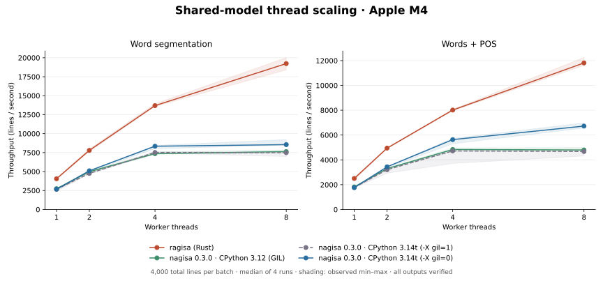
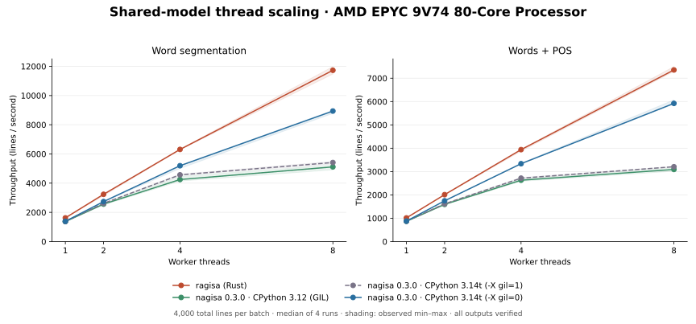

# Shared-model thread benchmarks

These benchmarks compare ragisa with **nagisa 0.3.0**, using CPython **3.12.14**
and the free-threaded build of CPython **3.14.7**. Both word segmentation and
full segmentation + POS labeling run at **1, 2, 4 and 8 worker threads**.
All workers in a process share one initialized model. Rust uses scoped
threads; Python uses `ThreadPoolExecutor`, with one task per worker.

## Results (2026-09-14)

### Apple M4

macOS 26.3 (arm64), 32 GB RAM, **4 performance + 6 efficiency cores**,
with default OS scheduling. Eight workers can run across both core types.



**Word segmentation** — median lines/second:

| Engine | 1 thread | 2 threads | 4 threads | 8 threads | 8 / 1 scaling |
|---|---:|---:|---:|---:|---:|
| ragisa | 4,050 | 7,793 | 13,691 | 19,231 | 4.75× |
| nagisa / 3.12 | 2,741 | 4,986 | 7,358 | 7,634 | 2.78× |
| nagisa / 3.14t, GIL | 2,659 | 4,755 | 7,516 | 7,490 | 2.82× |
| nagisa / 3.14t, no-GIL | 2,671 | 5,100 | 8,341 | 8,549 | 3.20× |

**Words + POS** — median lines/second:

| Engine | 1 thread | 2 threads | 4 threads | 8 threads | 8 / 1 scaling |
|---|---:|---:|---:|---:|---:|
| ragisa | 2,502 | 4,948 | 8,016 | 11,812 | 4.72× |
| nagisa / 3.12 | 1,818 | 3,296 | 4,835 | 4,796 | 2.64× |
| nagisa / 3.14t, GIL | 1,769 | 3,208 | 4,719 | 4,673 | 2.64× |
| nagisa / 3.14t, no-GIL | 1,767 | 3,440 | 5,633 | 6,722 | 3.80× |

At eight threads, ragisa is **2.25×** faster for words and **1.76×** for
words + POS than nagisa on 3.14t with the GIL disabled. Disabling the GIL
on the same 3.14t build improves its eight-thread throughput by **1.14×**
and **1.44×**, respectively. These ratios describe this corpus and host.

[Raw M4 report](benchmarks/apple-m4-threads-nagisa-0.3.0-2026-09-14.json).

### AMD EPYC 9V74

Linux 6.8.0 (x86_64), container limited to **16 vCPU / 8 GiB**. All
processes and threads use the same affinity pool, logical CPUs 16–23:
eight different physical cores on socket 0, with no SMT siblings in the
pool. The host is shared; affinity does not reserve these cores.
Both `nr_throttled` and `throttled_usec` had **zero delta** during the run.



**Word segmentation** — median lines/second:

| Engine | 1 thread | 2 threads | 4 threads | 8 threads | 8 / 1 scaling |
|---|---:|---:|---:|---:|---:|
| ragisa | 1,621 | 3,236 | 6,309 | 11,731 | 7.24× |
| nagisa / 3.12 | 1,370 | 2,565 | 4,248 | 5,114 | 3.73× |
| nagisa / 3.14t, GIL | 1,374 | 2,615 | 4,569 | 5,413 | 3.94× |
| nagisa / 3.14t, no-GIL | 1,386 | 2,737 | 5,195 | 8,939 | 6.45× |

**Words + POS** — median lines/second:

| Engine | 1 thread | 2 threads | 4 threads | 8 threads | 8 / 1 scaling |
|---|---:|---:|---:|---:|---:|
| ragisa | 1,013 | 2,010 | 3,939 | 7,354 | 7.26× |
| nagisa / 3.12 | 868 | 1,593 | 2,628 | 3,091 | 3.56× |
| nagisa / 3.14t, GIL | 872 | 1,616 | 2,717 | 3,207 | 3.68× |
| nagisa / 3.14t, no-GIL | 876 | 1,746 | 3,336 | 5,922 | 6.76× |

At eight threads, ragisa is **1.31×** faster for words and **1.24×** for
words + POS than nagisa on 3.14t with the GIL disabled. On the same 3.14t
build, disabling the GIL improves eight-thread throughput by **1.65×**
and **1.85×**, respectively. The no-GIL benefit is larger here than on M4.

[Raw AMD report](benchmarks/amd-epyc-9v74-threads-nagisa-0.3.0-2026-09-14.json).

Across both hosts, **1,024,000 timed outputs** matched the committed reference.
The reports contain the same source/model hashes and the same input sequence.

## GIL state

Importing the unmodified nagisa 0.3.0 PyPI wheel on CPython 3.14t emits a
warning and **automatically enables the GIL**: `nagisa_utils` does not declare
free-threading compatibility. A free-threaded interpreter alone therefore
does not establish that inference ran without the GIL.

The comparison includes four engines:

| Engine | Interpreter / configuration |
|---|---|
| ragisa | Rust 1.97.1, release build, bundled model |
| nagisa / 3.12 | CPython 3.12.14, standard GIL build |
| nagisa / 3.14t, GIL | CPython 3.14.7 free-threaded build, `-X gil=1` |
| nagisa / 3.14t, no-GIL | The same 3.14.7 build and wheel, `-X gil=0` |

The harness checks `Py_GIL_DISABLED` and `sys._is_gil_enabled()` before
importing nagisa, after import, and after each thread-count measurement.
It fails if the observed state differs from the requested state. A separate
process records what happens with the default import. All Python workers
must use `nagisa.np_model`; reports also record whether DyNet was imported.
No upstream source is modified or rebuilt for these measurements.

The explicit no-GIL override follows the threading scenario described by
[upstream's 0.3.0 release](https://github.com/taishi-i/nagisa/releases/tag/0.3.0).
Passing this corpus is evidence for this tested inference workload, not a
general thread-safety certification of every upstream API. The GIL-on
3.14t control uses a free-threaded build; it is not a standard 3.14 build.
See [Python's free-threading documentation](https://docs.python.org/3.14/howto/free-threading-python.html)
for import fallback and GIL-state checks.

## Workload and timing

- Each batch has **4,000 total lines**, regardless of thread count. It cycles
  through all **354** `wiki` / `wiki_multi` records in the committed parity
  corpus, then shuffles the indices with `random.Random(0)`. Original article
  links and CC BY-SA attribution are preserved in
  [fixture provenance](../tests/fixtures/README.md) and
  [Wikipedia sources](../tests/fixtures/wikipedia-sources.json).
  The published batch averages **43.75 Unicode characters per line**, with a
  range of 3–454; each engine processes the identical ordered batch.
- Each worker gets a contiguous, evenly sized slice of the same index list.
  Dispatch and output slots are prepared before timing. Each worker performs
  **10 untimed warmup calls** before the start barrier.
- The timer covers releasing the start barrier, all inference calls and
  retaining their materialized outputs, through the completion barrier.
  Model loading, process/thread creation, warmup, validation, output
  destruction and JSON I/O are excluded. Each timed output is compared with
  the committed reference after timing; mismatches fail the benchmark.
- Words compares `JaSegmenter::words()` with a fresh `nagisa.tagging(text).words`.
  Words + POS compares `Tagger::tagging()` with a fresh Python result and
  reading **both** `.words` and `.postags`. Rust keeps typed `PosTag` values;
  parsing expected labels happens before timing.
- There are **four independent runs per task/engine**, each in a fresh
  process. Engine order and thread-count order rotate each run, so each
  occupies every position once. Native BLAS/OMP thread limits are set to one
  to prevent nested parallelism. Each engine process uses threads for
  concurrency; no process pool is used.
- Throughput is `4,000 / batch_seconds`; tables use the median of the four
  rates. Scaling divides each engine's rate by its own one-thread median.
  The chart shading is the observed minimum–maximum across runs, not a
  confidence interval. Raw reports contain all batch durations, per-worker
  counts, inputs, expected outputs, interpreter/wheel metadata and hashes.

The batch inputs differ from upstream's release chart, so these results
are not a reproduction of its exact rates or claimed scaling factors.
CPython 3.14 uses newer Unicode data; this corpus matches both interpreters,
while ragisa's broader normalization compatibility target remains CPython
3.12 / Unicode 15.0.0.

## Reproduction

The following installs the released wheels for inference. nagisa's package
metadata still requests DyNet38, so `--no-deps` deliberately omits that
training dependency after installing NumPy and six explicitly.

```sh
uv venv --python 3.12.14 .venv
uv venv --python 3.14.7t results/venv-nagisa-314t
uv pip install --python .venv/bin/python -r tools/requirements-threads.txt
uv pip install --python .venv/bin/python --no-deps nagisa==0.3.0
uv pip install --python results/venv-nagisa-314t/bin/python -r tools/requirements-threads.txt
uv pip install --python results/venv-nagisa-314t/bin/python --no-deps nagisa==0.3.0
.venv/bin/python tools/benchmark_threads.py \
  --python314t results/venv-nagisa-314t/bin/python \
  --output results/threads.json
```

The driver builds the Rust worker in release mode. `--python312 PATH` can
select a different 3.12 executable. `--mode words` or `--mode tagging` limits
the tasks. `--cpus 16,17,18,19,20,21,22,23` selects a Linux CPU affinity pool
for every worker process and thread. Choose CPUs appropriate to your machine;
affinity does not reserve cores. Do not run competing builds/tests during
measurement. `--lines 64 --runs 1 --warmup 2` is the CI correctness smoke
configuration, not a performance measurement.

To render the standalone chart (Matplotlib 3.11.2 was used for the published SVGs):

```sh
uv venv --python 3.12 results/venv-plots
uv pip install --python results/venv-plots/bin/python matplotlib==3.11.2
results/venv-plots/bin/python tools/plot_threads.py results/threads.json results/threads.svg
```
